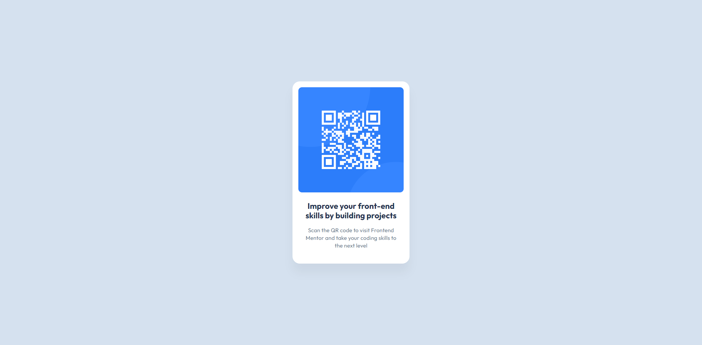

# Frontend Mentor - QR code component solution

This is a solution to the [QR code component challenge on Frontend Mentor](https://www.frontendmentor.io/challenges/qr-code-component-iux_sIO_H). Frontend Mentor challenges help you improve your coding skills by building realistic projects.

## Screenshot

### Links

- Solution URL: [Github Repository](https://github.com/cliquant/frontend-mentor-qr-code/)
- Live Site URL: [Github Pages](https://cliquant.github.io/frontend-mentor-qr-code/index.html)

## Author

- Github - [@cliquant](https://github.com/cliquant)
- Frontend Mentor - [@cliquant](https://frontendmentor.io/profile/cliquant)
